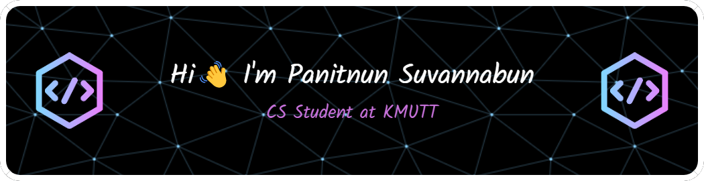

<!--  -->

<h4 align="left">About me 👇</h4>

- 💻 I’m currently studying for **a bachelor's degree in Computer Science at the KMUTT University**

- 📚 I’m currently learning **Microservices**

- 🌱 I’m interested in **Data and Cloud computing Technology**

- 📧 Message to me at **panitnun.6243@gmail.com**

<h4 align="left">Contact with me 📞</h4>

&nbsp;
  &nbsp;

<h4 align="left">My Knowledge 🧠</h4>

> Programming Languages
>>   
>
> Mobile/Web/Desktop framework and library
>> 
>
> Cloud computing
>> <!-- -->
>
> Devops tools
>> 
>
> Database
>> 
>
> Data science/engineer
>> 
>
> Other tools
>>  
>

<h4 align="left">My Github status 📈</h4>

<h4 align="left">My Github trophy 🏆</h4>

  

<!---
Panitnun-6243/Panitnun-6243 is a ✨ special ✨ repository because its `README.md` (this file) appears on your GitHub profile.
You can click the Preview link to take a look at your changes.
--->
